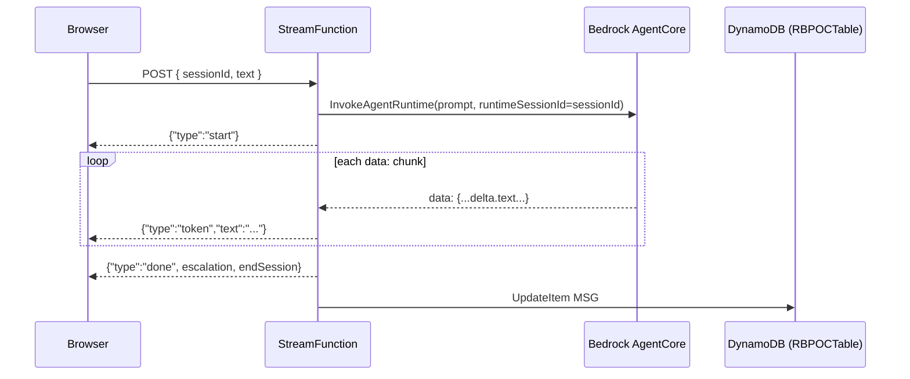

# Backend Architecture & Lambda Reference

Developer documentation for the two Lambdas in `personal-web-backend`. For setup and deploy **steps**, see [`../DEPLOYMENT.md`](../DEPLOYMENT.md); for the HTTP/stream **wire contracts** the frontend depends on, see `personal-web/API_CONTRACTS.md`.

---

## 1. Overview

```
Browser (personal-web)
   │
   ├── GET /config, GET /suggestions ─────────────┐
   ├── POST /sessions/{id}/feedback ──────────────┤ HTTP API (API Gateway v2)
   ├── POST /sessions/{id}/messages/feedback ──────┘        │
   │                                                        ▼
   │                                                  ApiFunction (api-lambda)
   │                                                        │  read/write
   │                                                        ▼
   │                                             DynamoDB: RBPOCTable (single table)
   │
   └── POST {StreamFunctionUrl} ──► StreamFunction (streaming-lambda)
                                          │  InvokeAgentRuntime
                                          ▼
                                  Bedrock AgentCore runtime
                                          │  (NDJSON tokens back)
                                          ▼  write
                                     DynamoDB: RBPOCTable (single table)
```

Two Lambdas because they need **different front doors**: buffered JSON endpoints work over API Gateway, but Lambda **response streaming** only works over a **Function URL** with `InvokeMode=RESPONSE_STREAM`. Both are Node.js 22, arm64, CommonJS.

**Session ownership (invariant across both Lambdas):** the frontend generates the `sessionId` (v4 UUID) and owns the session record (`startedAt`, `endedAt`, `durationMs`, `messageCount`, `questionCount`). The backend only **consumes** the id (upsert-by-id) and **never** recomputes the duration or allocates a session id.

---

## 2. StreamFunction (`streaming-lambda/index.js`)

### Purpose
Relays a Bedrock AgentCore runtime to the browser as a live NDJSON token stream, and logs each Q&A turn to DynamoDB.

### Trigger
Lambda **Function URL**, `AuthType: NONE`, `InvokeMode: RESPONSE_STREAM`, CORS `POST` from any origin. The handler is wrapped in `awslambda.streamifyResponse(...)` — a runtime-provided global that only exists on AWS.

### Request (event.body)
```json
{ "sessionId": "f47ac10b-...-c3479", "text": "How do I reset my password?", "messageId": "m1a2b3c_4" }
```
`session_id` / `prompt` are also accepted as aliases. `messageId` is the client id of the answer bubble; the turn is stored under it so the later thumbs attach to the same entry (a fallback id is generated if omitted). Missing `sessionId` or `text` → a single `error` event and the stream closes.

### Response (NDJSON, one JSON object per line)
| Event | Shape | When |
|---|---|---|
| start | `{"type":"start"}` | Immediately after the agent invocation opens. |
| token | `{"type":"token","text":"..."}` | For each text delta parsed from the agent. |
| done | `{"type":"done","escalation":false,"endSession":false}` | After the agent stream ends. |
| error | `{"type":"error","message":"..."}` | On any failure (bad input, agent error). |

The only response header set in code is `Content-Type: application/x-ndjson`. **CORS (and the `OPTIONS` preflight) is handled entirely by the Function URL's CORS config** — the handler must not set `Access-Control-*` headers too, or Lambda appends them to the URL-config headers and the browser sees a duplicate `Access-Control-Allow-Origin` (`*, *`) and rejects the response.

### Handler flow
1. Build the streaming HTTP response (`HttpResponseStream.from`) with status 200 + headers.
2. Parse and validate `{ sessionId, text }`; validate `AGENT_RUNTIME_ARN` is configured.
3. `InvokeAgentRuntimeCommand` with `agentRuntimeArn`, `runtimeSessionId: sessionId`, and a `payload` buffer of `{ prompt, session_id, actor_id: "default-user" }`.
4. Write `start`, then iterate `agentResponse.response` (async byte chunks):
   - Decode into a line buffer; process complete lines split on `\n`.
   - Only lines beginning `data:` are considered; the payload after `data:` is JSON-parsed.
   - **Token extraction** tries, in order: `obj.event.contentBlockDelta.delta.text`, `obj.delta.text`, `obj.text`, or the raw string. Non-JSON payloads are treated as raw text.
   - **Signal capture**: boolean `endSession` / `escalation` are read if present at the top level or under `obj.metadata`.
   - Each token is appended to `fullAnswer` and written as a `token` event.
5. Write the `done` event carrying the captured `escalation` / `endSession`.
6. Best-effort **single `UpdateItem`** on the per-message item (`PK=SESSION#<sessionId>`, `SK=MSG#<messageId>`) setting `{ type, sessionId, messageId, question, answer, ts, escalation, endSession, createdAt (if_not_exists), updatedAt }`. It sets only the Q&A fields, so it merges with — never clobbers — any `feedbackRating` the api-lambda already wrote on that same item. A DynamoDB failure is logged, never thrown.
7. `end()` the stream (also runs on the error path).

### End-of-session (important)
The frontend does **no** keyword matching — it closes the chat only when `done.endSession === true`. This Lambda merely **forwards** whatever the agent emits. **Your Bedrock agent must set `endSession: true`** in its streamed output when the user indicates they are done (e.g. "no thanks", "that's all"), and treat a bare "yes" as a normal turn. `escalation: true` works the same way (reserved for a human-handoff hint). If the agent never emits them, they stay `false` and the manual "End chat" button remains the fallback.

### Environment variables
| Var | Default | Notes |
|---|---|---|
| `AWS_REGION` | `us-east-2` | Auto-set by the runtime. |
| `AGENT_RUNTIME_ARN` | — | Required. The agent to invoke. |
| `TABLE_NAME` | `RBPOCTable` | The single shared table. |

### IAM (granted in template.yaml)
`bedrock-agentcore:InvokeAgentRuntime` on the agent ARN (and `/*`), plus DynamoDB CRUD on `RBPOCTable`, plus basic Lambda logging.

### Notes
- Timeout 120s, memory 512 MB — tune to your agent's longest expected answer.
- `@aws-sdk/client-bedrock-agentcore` is **not** in the Lambda runtime, so it is bundled via `package.json` at `sam build`.
- Cold start includes constructing the Bedrock + DynamoDB clients once per container (module scope) — reused across warm invocations.

---

## 3. ApiFunction (`api-lambda/index.js`)

### Purpose
Serves the four buffered JSON endpoints and persists feedback.

### Trigger
API Gateway **HTTP API** (payload format 2.0). Routing is by `event.routeKey`; the `{sessionId}` path parameter arrives in `event.pathParameters.sessionId` (URL-decoded in code).

### Endpoints
| routeKey | Handler | DynamoDB op | Response |
|---|---|---|---|
| `GET /config` | `getConfig` | `GetItem` (`PK=CONFIG`, `SK=default`) | `200` config object (defaults merged under stored values) |
| `GET /suggestions` | `getSuggestions` | `Query` (`PK=SUGGESTIONS`) | `200 {suggestions:[{id,question}]}` — top N by `count` desc |
| `POST /sessions/{sessionId}/feedback` | `postSessionFeedback` | `UpdateItem` on the `META` item (`SK=META`) — sets summary fields | `200 {ok:true}` |
| `POST /sessions/{sessionId}/messages/feedback` | `postMessageFeedback` | `UpdateItem` on the message item (`SK=MSG#<messageId>`) → `feedbackRating` | `200 {ok:true}` (or `400` if `messageId` missing) — re-submittable, updates in place |

Unknown routes → `404 {error,routeKey}`. Any thrown error → `500 {error:"Internal error"}` (logged).

### Behavior details
- **`getConfig`** merges `DEFAULT_CONFIG` (mirrors the frontend fallback) with the stored row, so the endpoint returns valid copy even before the config row is seeded. A read failure logs and still returns defaults.
- **`getSuggestions`** queries the `SUGGESTIONS` partition, filters rows with a `question`, sorts by numeric `count` descending, takes `SUGGESTIONS_LIMIT` (default 5), and maps to `{id, question}`. Any failure returns `{suggestions:[]}` (the UI then hides the section) rather than erroring.
- **`postSessionFeedback`** writes the client-owned record **verbatim** (`rating`, `reasons`, `other`, `startedAt`, `endedAt`, `durationMs`, `messageCount`, `questionCount`) plus server `createdAt`/`updatedAt` onto the tiny `META` item (`SK=META`) via `UpdateItem`. It does **not** recompute duration; the item need not exist first (`UpdateItem` creates it). The `META` item is separate from the message items, so it can never approach the size limit.
- **`postMessageFeedback`** is **re-submittable**: a **single `UpdateItem`** on the message item (`SK=MSG#<messageId>`) sets `feedbackRating` + `feedbackAt` (and seeds `question`/`answer` from the vote via `if_not_exists`, in case the turn wasn't logged yet). It touches only the feedback fields, so it merges with the Q&A the streaming-lambda wrote; a repeat vote updates in place (never a duplicate, no new item). `messageId` is required.

### Body & CORS handling
- `parseBody` handles base64-encoded bodies and malformed JSON (returns `{}`).
- CORS is handled by the HTTP API's `CorsConfiguration` (in template.yaml). Responses here carry **no** CORS headers, avoiding duplicate-header issues. Pre-flight `OPTIONS` is answered by API Gateway, not this code.

### Environment variables
| Var | Default |
|---|---|
| `AWS_REGION` | `us-east-2` (auto) |
| `TABLE_NAME` | `RBPOCTable` |
| `CONFIG_KEY` | `default` |
| `SUGGESTIONS_LIMIT` | `5` |
| `CONFIG_KEY` | `default` |
| `SUGGESTIONS_LIMIT` | `5` |

### IAM (granted in template.yaml)
DynamoDB CRUD on `RBPOCTable`; basic Lambda logging.

### Notes
- Timeout 30s, memory 256 MB.
- `@aws-sdk/client-dynamodb` / `lib-dynamodb` are bundled via `package.json`. The `DynamoDBDocumentClient` is created once at module scope (`removeUndefinedValues: true`, so `null`/absent fields are dropped cleanly).

---

## 4. DynamoDB data model

One table (`RBPOCTable`), `PK` / `SK`. Every item carries a `type` attribute. A session is **many small items under one partition** (`PK = SESSION#<sessionId>`) — a tiny `META` item plus one item per Q&A turn — so no item can approach the 400 KB limit, and a whole session is one `Query PK = SESSION#<sessionId>` away.

| Item | PK / SK | Written by | Fields |
|---|---|---|---|
| Session meta | `SESSION#<sessionId>` / `META` | ApiFunction | `rating`, `reasons`, `other`, `startedAt`, `endedAt`, `durationMs`, `messageCount`, `questionCount`, `createdAt`, `updatedAt` |
| Q&A turn (+thumbs) | `SESSION#<sessionId>` / `MSG#<messageId>` | both Lambdas | `question`, `answer`, `ts`, `escalation`, `endSession`, `feedbackRating`, `feedbackAt`, `createdAt`, `updatedAt` |
| Config | `CONFIG` / `default` | seeded / read | `botName`, `greeting`, `closing`, `followUp`, `maxQuestionWords`, `feedbackReasons` |
| Suggestion | `SUGGESTIONS` / `SUGG#<id>` | seeded / read | `id`, `question`, `count` |

The table is on-demand (pay-per-request). See `DEPLOYMENT.md` §1 for creation and §5 for seeding.

---

## 5. Streaming sequence



---

## 6. Local testing

You can invoke the API Lambda locally with a saved HTTP API event:

```bash
# from personal-web-backend/
sam build
sam local invoke ApiFunction -e docs/events/get-config.json
```

Example event `docs/events/get-config.json`:
```json
{ "routeKey": "GET /config", "rawPath": "/config", "requestContext": { "http": { "method": "GET" } } }
```

> `sam local` needs Docker. Response streaming (`StreamFunction`) is **not** emulated locally by `sam local` — test it against a deployed Function URL with the `curl -N` command in `DEPLOYMENT.md` §7. Its `awslambda` global also only exists on AWS, so it cannot run under plain Node locally.

---

## 7. Adding a new HTTP endpoint

1. Add a `case "METHOD /path":` to the `switch` in `api-lambda/index.js` and a handler function.
2. Add a matching `HttpApi` event under `ApiFunction.Events` in `template.yaml` (same `Method`/`Path`).
3. If it touches a new table, add a `DynamoDBCrudPolicy`/`DynamoDBReadPolicy` for it and an env var.
4. `sam build && sam deploy` (or `sam sync --code --resource-id ApiFunction` for a code-only change on an existing route).

---

## 8. Conventions recap

- **Region:** us-east-2 everywhere (functions, tables, agent).
- **Runtime:** `nodejs22.x`, arm64, CommonJS (`require`, `exports.handler`).
- **Errors:** buffered endpoints return JSON with an HTTP status; the stream returns an `error` NDJSON event (never a broken connection where avoidable).
- **Independence:** each Lambda has its own folder + `package.json`, so it can be redeployed alone (`sam sync --code --resource-id ...` or raw `update-function-code` — see `DEPLOYMENT.md` §9).
